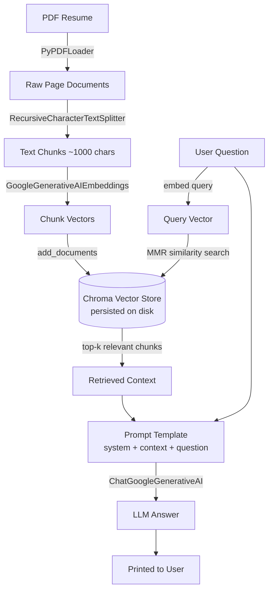

# RAG Architecture — Resume Q&A System

A Retrieval-Augmented Generation (RAG) pipeline that lets a user ask natural-language questions about a PDF resume and get answers grounded only in that document.

## 1. High-Level Flow



There are two distinct phases: **Indexing** (runs once) and **Query** (runs every time a question is asked).

## 2. Phase 1 — Indexing (build the knowledge base)

This happens once, before any question is asked, and is skipped on future runs if the vector store already has data.

| Step | Component | What it does |
|---|---|---|
| Load | `PyPDFLoader` | Extracts raw text from the PDF, one `Document` object per page |
| Split | `RecursiveCharacterTextSplitter` | Breaks each page into ~1000-character chunks with 20-char overlap, so retrieval can return focused snippets instead of whole pages |
| Embed | `GoogleGenerativeAIEmbeddings` (`gemini-embedding-2-preview`) | Converts each chunk's text into a high-dimensional vector that captures its meaning |
| Store | `Chroma` vector store | Persists `(vector, text, metadata)` for every chunk to disk at `chroma-db/`, so it survives across script runs |

**Why split before embedding?** Embedding a whole page as one vector blurs together unrelated sections (e.g. "Skills" and "Education"). Smaller chunks mean each vector represents one focused idea, so similarity search can zero in on exactly the relevant paragraph.

## 3. Phase 2 — Query (answer a question)

This runs every time the user types a question in the loop.

| Step | Component | What it does |
|---|---|---|
| Embed query | Same embedding model | Converts the user's question into a vector in the same vector space as the stored chunks |
| Retrieve | `vector_store.as_retriever(search_type="mmr")` | Finds the top-`k` chunks whose vectors are closest to the query vector, using MMR to avoid returning near-duplicate chunks |
| Assemble context | `"\n\n---\n\n".join(...)` | Merges the retrieved chunks into one string, separated clearly, to feed the LLM |
| Prompt | `ChatPromptTemplate` | Wraps the context + question in a system instruction telling the model to answer *only* from the given context |
| Generate | `ChatGoogleGenerativeAI` (`gemini-3.1-flash-lite`) | Produces a natural-language answer grounded in the retrieved chunks |

## 4. Why "Retrieval-Augmented"?

Without retrieval, you'd have two bad options:
- **Send the whole resume every time** — wastes tokens (cost), and breaks down entirely if the document is longer than the model's context window.
- **Rely on the model's own knowledge** — it has never seen this specific resume, so it would hallucinate.

RAG solves both: it searches a pre-indexed knowledge base for just the relevant pieces, then hands *only those pieces* to the LLM as grounding context. The model's job shrinks from "know everything" to "read this short excerpt and answer accurately."

## 5. Component Reference

```
┌─────────────────────────────────────────────────────────────┐
│                      INDEXING (once)                        │
│                                                               │
│  PDF ──► Loader ──► Splitter ──► Embedder ──► Vector Store   │
│                                                               │
└─────────────────────────────────────────────────────────────┘

┌─────────────────────────────────────────────────────────────┐
│                    QUERY (every question)                   │
│                                                               │
│  Question ──► Embedder ──► Retriever ──► Context             │
│                                              │                │
│                                              ▼                │
│                          Prompt Template ──► LLM ──► Answer  │
│                                ▲                              │
│                          Question                             │
└─────────────────────────────────────────────────────────────┘
```

## 6. Tech Stack

| Layer | Technology |
|---|---|
| PDF parsing | `langchain_community.document_loaders.PyPDFLoader` |
| Chunking | `langchain_text_splitters.RecursiveCharacterTextSplitter` |
| Embeddings | Google `gemini-embedding-2-preview` via `langchain_google_genai` |
| Vector store | `Chroma` (`langchain_chroma`), persisted to local disk |
| Retrieval strategy | MMR (Maximal Marginal Relevance) — balances relevance with diversity across returned chunks |
| LLM | Google `gemini-3.1-flash-lite` via `langchain_google_genai` |
| Orchestration | LangChain (`ChatPromptTemplate`, message formatting) |

## 7. Cost Touchpoints

Two operations hit the paid API:

1. **Embedding** — once at indexing time (all chunks), plus once per question (query embedding). Cheap: `gemini-embedding-2-preview` is $0.20/1M tokens.
2. **Generation** — once per question, billed on input (context + question) and output (answer) tokens. `gemini-3.1-flash-lite` is $0.25/1M input, $1.50/1M output.

Indexing cost is paid once (skipped on reruns if the store is already populated); generation cost scales linearly with the number of questions asked.

## 8. Possible Extensions

- **Multi-document support** — index multiple resumes/PDFs into the same or separate collections, filter by `metadata` at query time.
- **Source citations** — return `doc.metadata["page"]` alongside the answer so the user can see which page it came from.
- **Conversation memory** — carry prior Q&A turns into the prompt so follow-up questions ("what about his most recent role?") resolve correctly.
- **Streaming responses** — use `model.stream()` instead of `model.invoke()` for token-by-token output in the terminal.